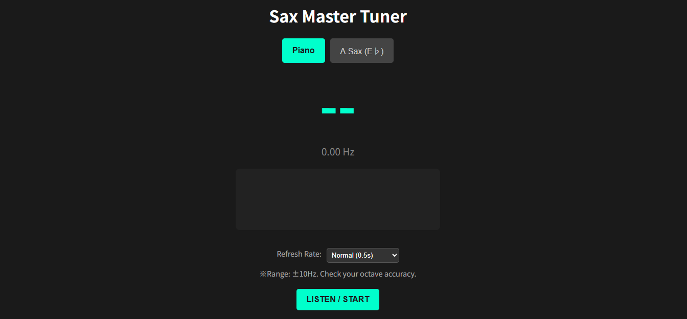

# Sax Octave Pitch Trainer
サックスのオクターブ練習に特化した、高精度・リアルタイム・ピッチチューナーです。

## 背景と目的
サックスの演奏において、低音域と高音域（オクターブ差）のピッチを安定させることは非常に重要です。このアプリは、特定のレッスン課題である「**1オクターブ上の音を、基音の±10Hz以内に収める**」というトレーニングをサポートするために開発されました。

一般的なチューナーよりも視認性を高め、特定の範囲（±10Hz）のズレに特化したフィードバックを提供します。

## 主な機能
- **移調対応（Eb管）**: アルトサックスの運指（譜面上の音名）と表示を一致させる「Alto Sax Mode」を搭載。

- **±10Hz ターゲットメーター**: 理想のピッチからのズレを可視化。許容範囲内なら緑、範囲外なら赤で表示。

- **可変リフレッシュレート**: 練習スタイルに合わせて、更新周期を 0.1s / 0.5s / 1.0s から選択可能。

- **Webベース**: ブラウザさえあれば、PCでもスマホでもすぐに練習を開始できます。

## 技術スタック
- **Engine**: Tone.js (Web Audio API Wrapper)
- **Algorithm**: Autocorrelation (自己相関関数) によるピッチ検出

- **Frontend**: HTML5 / CSS3 / JavaScript (Canvas API)

## 使い方
START ボタンをクリックしてマイクを有効にします。
楽器に合わせて Piano (実音) または Alto Sax (移調音) を選択します。

基準となる音を吹きます。

オクターブ上の音を吹き、メーターの針が ±10Hz の緑色の範囲に収まるようにアンブシュアを調整します。

## 開発のこだわり
- **0.5s Refresh Rate**: 初期の要件に基づき、人間の認識に最適な0.5秒周期をデフォルトに設定。

- **Transposition Logic**: 検知したMIDIノート番号から3半音減算することで、Eb管の移調を数学的に解決。

- **Minimalist UX**: 練習中に余計な操作を必要としない「自動ターゲット追従型」のロジックを採用。