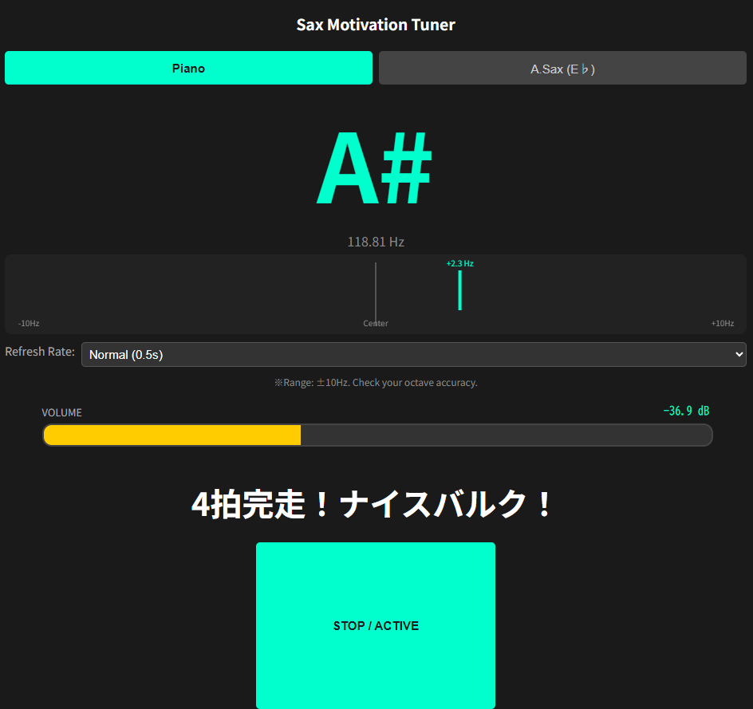

# 🎷 Sax Motivation Tuner：開発の軌跡とこだわり
## 1. 「マッスル」な応援システム
ただのチューナーではなく、練習者の心（と筋肉）を奮い立たせる掛け声システムを搭載。

通常メッセージ: 「キレてる！」「デカい！」など、ボディビル大会でおなじみの掛け声がランダムに飛び出します。

- **レア演出**: 特定の厳しい条件をクリアした時だけ、特別な称賛が贈られます。
- **5秒以上のロングトーン**: 「肺が鉄鉄鋼の塊か！！」
- **音量最大（イエローゾーン）到達**: 「会場の屋根が吹き飛ぶぞ！！」
- **精密なピッチ維持（1秒間持続）**: 「彫刻のような精密さ！」
## 2. 音楽的に心地よい「余韻」の設計
デジタル的な「パッと消える」不自然さを排除し、サックスの吹奏感に合わせた挙動を追求。

- **消滅タイマー**: 掛け声は表示から3秒後にふわっと消えるように設定し、画面の煩雑さを防いでいます。
- **音名のキープ**: 音が止まった後も約0.8秒間は最後の音名を表示し続け、練習の振り返りをしやすくしました。
- **4拍完走判定**: テンポ80（3000ms）連続で吹き続けると「4拍完走！ナイスバルク！」と祝福。ブレス等の一瞬の途切れ（0.5秒以内）は許容する優し設計です。

## 3. モチベーションを可視化する「3段階ボリュームバー」
音量を客観的なデシベル（dB）で表示し、バーの色によってパワーを評価。
- **0% 〜 33% (水色)**: 安定した弱音。
- **34% 〜 65% (緑色)**: 響きのある中音。
- **66% 〜 100% (黄色)**: 爆発的なパワー。ここが「屋根を吹き飛ばす」トリガーになります。
- **ピークホールド**: 音が小さくなる時はあえてゆっくりバーを下げることで、音の「減衰」を美しく表現しました。

## 4. 移調楽器への対応
サックス奏者に欠かせない、E♭（アルトサックス等）への移調表示モードを完備。「ピアノ（実音）」と「サックス（移調音）」をボタン一つで切り替え可能です。

##  技術構成
- **Engine**: Tone.js (Web Audio API) による高精度な周波数解析。
- **UI**: HTML5 Canvas によるリアルタイムなメーター描写。
- **Logic**: 自力相関（Auto-correlation）によるピッチ抽出アルゴリズム。