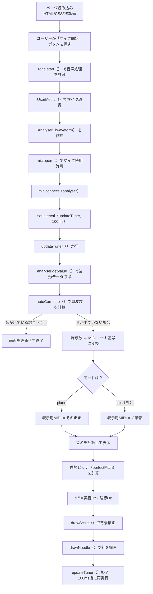

```mermaid
flowchart TD

    A[ページ読み込み<br>HTML/CSS/JS準備] --> B[ユーザーが「マイク開始」ボタンを押す]

    B --> C[Tone.start（） で音声処理を許可]
    C --> D[UserMedia（）でマイク取得]
    D --> E[Analyser（waveform） を作成]
    E --> F[mic.open（）でマイク使用許可]
    F --> G[mic.connect（analyser）]

    G --> H[setInterval（updateTuner, 100ms）]

    %% updateTuner の流れ
    H --> I[updateTuner（）実行]

    I --> J[analyser.getValue（）で波形データ取得]
    J --> K[autoCorrelate（）で周波数を計算]

    K -->|音が出ている場合（-1）| Z1[画面を更新せず終了]
    K -->|音が出ていない場合| L[周波数 → MIDIノート番号に変換]

    L --> M{モードは？}
    M -->|piano| N1[表示用MIDI = そのまま]
    M -->|sax（E♭）| N2[表示用MIDI = -3半音]

    N1 --> O[音名を計算して表示]
    N2 --> O

    O --> P[理想ピッチ（perfectPitch）を計算]
    P --> Q[diff = 実音Hz - 理想Hz]

    Q --> R[drawScale（）で背景描画]
    R --> S[drawNeedle（）で針を描画]

    S --> T[updateTuner（）終了 → 100ms後に再実行]
```